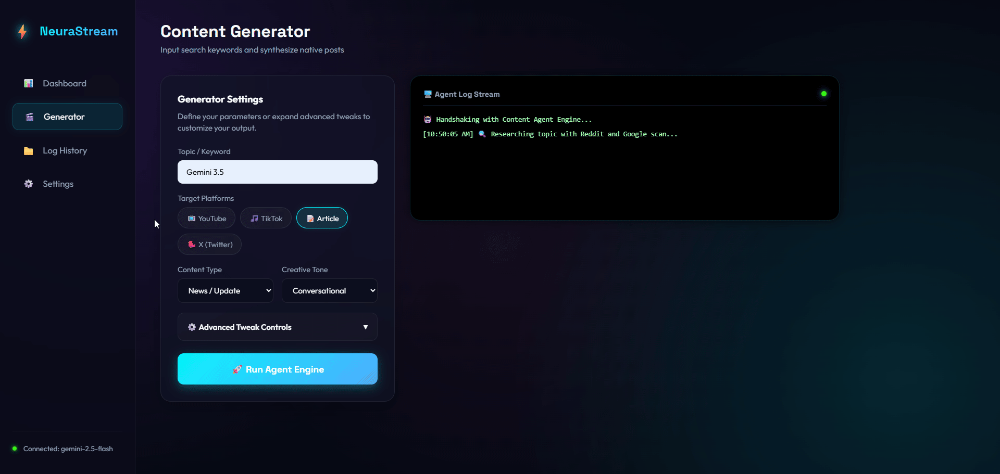

# NeuraStream - AI Agent Content Engine

*LangGraph, Google Gemini, FastAPI, Reddit API*



## Why NeuraStream?
Tracking a topic across Reddit and Google by hand is slow and messy. NeuraStream automates multi-source research and turns it into platform-ready content, with an AI critic checking quality before anything ships.

## How It Works
NeuraStream employs a multi-agent workflow to deliver high-quality, platform-native content:
- **Research Agents**: Multiple agents perform comprehensive research using Reddit and Google Search APIs to gather the latest information on a given topic.
- **Drafting Agent**: A specialized agent drafts content tailored for specific platforms like YouTube, TikTok, Articles, and X (Twitter).
- **Honest Critic**: A dedicated LLM call analyzes the generated content to predict its performance and check for factual accuracy, readability, and explicit language.
- **Web UI Dashboard**: A FastAPI-powered dashboard allows you to control the agent, monitor real-time logs, view analytics, and browse a filterable history of all content generation runs.

## Core Features
- **Multi-Source Research**: Leverages Reddit and Google Search for comprehensive topic analysis.
- **Structured Content Generation**: Creates platform-native content for YouTube, TikTok, Articles, and X (Twitter).
- **Configurable Generation**: Fine-tune content by selecting a target audience and output format (e.g., Markdown, JSON).
- **Quality & Performance Analysis**: Includes the "Honest Critic" LLM call for performance prediction and local checks for readability, factuality, and explicit content.
- **Web UI Dashboard**: A FastAPI-powered frontend to control the agent, view analytics, and browse a detailed history of all runs.
- **Filterable History**: The history UI supports filtering by topic, date range, platform, and success status, with options to copy and export data.
- **Prompt Management**: All prompts are centrally managed in `app/core/prompts.py` and can be customized via preset files in `config/`.

## Sample Output
Here is a snippet of an article generated by NeuraStream:

```markdown
### The Future of AI in the Workplace

The integration of artificial intelligence into the workplace is no longer a futuristic concept but a present-day reality. From automating repetitive tasks to providing deep analytical insights, AI is reshaping industries and redefining job roles. Companies that embrace this transformation are gaining a competitive edge, while employees who adapt to working alongside AI are finding new opportunities for growth. The key to success is not to fear automation but to leverage it as a tool for innovation and efficiency.
```

## Setup
1. Clone the repository:
   ```sh
   git clone https://github.com/robdreamville/reddit-google-info-agent.git
   cd reddit-google-info-agent
   ```
2. Create and activate a Python virtual environment:
   ```sh
   python -m venv venv
   source venv/bin/activate  # On Windows: venv\Scripts\activate
   ```
3. Install dependencies:
   ```sh
   pip install -r requirements.txt
   ```
4. Add your API keys and secrets to a new `.env` file (see `.env.example` for a template).

## .env File
Create a `.env` file in the root directory and add your keys:
```
GEMINI_API_KEY="your_gemini_api_key"
REDDIT_CLIENT_ID="your_reddit_client_id"
REDDIT_CLIENT_SECRET="your_reddit_client_secret"
```

## Usage
Run the FastAPI server:
```sh
uvicorn app.main:app --reload
```
Navigate to `http://127.0.0.1:8000` in your browser to access the dashboard.

## Logging
- All agent runs are logged in the `logs/` directory.
- Logs can be viewed, filtered, and exported from the "Log History" tab in the web UI.

## Extending
- **Add New Tools**: Create new tool functions in `app/tools/` and integrate them into the agent workflow in `app/agents/content_creator.py`.
- **Customize Prompts**: Modify the prompt templates in `app/core/prompts.py`.
- **Change Config**: Adjust default behaviors, model names, and presets in `config/app_config.py`.

## About Me
*   **Name**: [Your Name]
*   **LinkedIn**: [Your LinkedIn Profile URL]
*   **GitHub**: [Your GitHub Profile URL]
*   **Portfolio**: [Your Portfolio URL]
